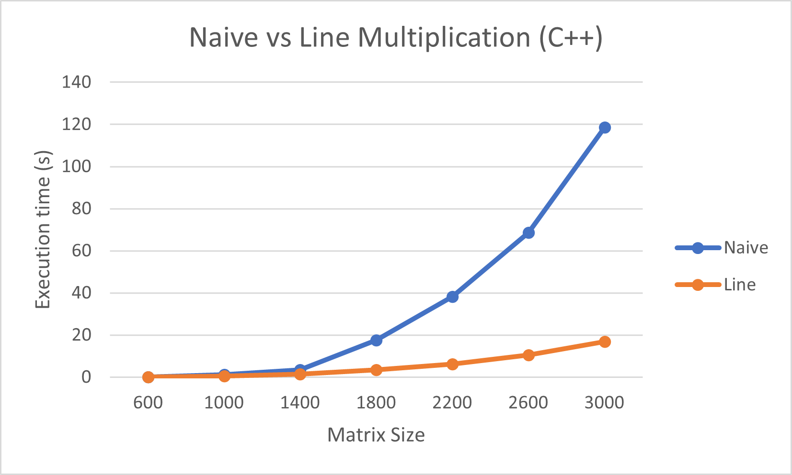
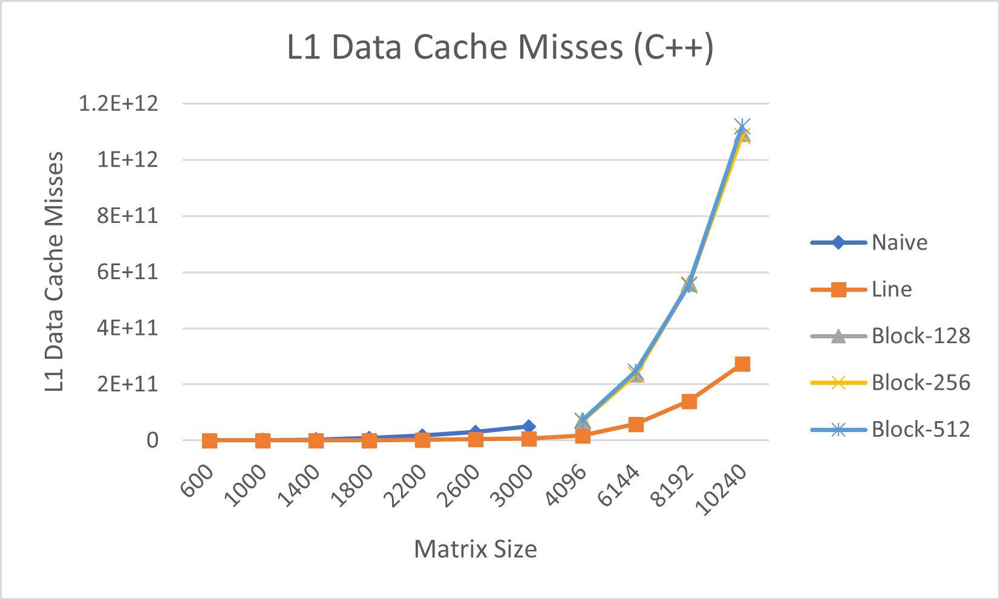

# Performance evaluation of a single core

This project was developed for the CPD Curricular Unit (Parallel and Distributed Computation) in the year 2021/22 by the following students:
|  |  |
| ------ | ------ |
| José Pedro Peixoto Ferreira | up201904515@edu.fe.up.pt |
| Lucas Calvet Santos | up201904517@edu.fe.up.pt |
| Sérgio Rodrigues da Gama | up201906690@edu.fe.up.pt |
| | |

## Problem Description and Algorithms Explanation

In this project, we analyse the performance of a single core program, taking into account the impact of accessing large amounts of data. This analysis is made by running different algorithms for solving the same problem, in two completely different languages, in this case C++ and Python. The problem to be solved is the multiplication of two square matrices, which are matrices of the same width and height.

Meanwhile, the algorithms chosen to solve this problem were the simple (naive) matrix multiplication, line matrix multiplication and block matrix multiplication, where the initial hypothesis was that they should be incrementally more efficient in terms of cache memory usage, and therefore have a better performance.

### Naive Matrix Multiplication

This algorithm is the simpler approach to solve the matrix multiplication problem. It is composed by three loops, where the two inner loops traverse all the matrix elements, line by line in the first matrix and column by column in the second one. The outermost loop just fills the resultant matrix with the results.

### Line Matrix Multiplication

At a first glance, this algorithm may seem very similar to the previous one. However, the major difference relies in the way that it traverses the matrix. The naive algorithm had to get the column of the second matrix, which means that in each iteration it obtains the whole matrix line, when it is only going to need a single element. As it is imaginable, this is very memory (cache) expensive, as it in each iteration `[(n-1)/n × 100] % ` of the data loaded to memory will be useless (being n the number of elements loaded into cache). For example, if all 10 elements from a line of a matrix of size 10 by 10 are loaded to cache, 90% of the data loaded won't be used for the actual calculations.

### Block Matrix Multiplication

Finally, in this last algorithm, we partition the matrices in blocks of a constant size. This way, the elements to be multiplied are matrices themselves instead of numbers like in previous algorithms. The multiplication of said matrices are made individually.

## Performance Metrics

In order to better analyse the performance of a single core we came up with a group of relevant metrics:

- **Time** - The time an instance of the program takes to complete the multiplication. This is the most significant way to infer an algorithm's efficiency, as we always crave to obtain the solution in the shortest time possible.

- **L1 Data Cache Misses** - Number of times a request to retrieve data from the level 1 cache was not met.

- **L2 Data Cache Accesses** - Number of requests made to retrieve data from the level 2 cache. 

- **L2 Data Cache Misses** - Number of times a request to retrieve data from the level 2 cache was not met.

- **L2 Miss Rate** - The ratio between the data cache misses and accesses for memory of level 2.

- **L3 Data Cache Accesses** - Number of requests made to retrieve data from the level 3 cache. 

- **Waiting Cycles** - Cycles stalled waiting for memory write.

- **Total Cycles** - Total of executed cycles.

- **Waiting Cycles Rate** - Ratio between waiting and total cycles.

- **GFlops** - The number of 10^9 floating-point operations per second, an important metric for CPU manufacturers.

## Results and Analysis

The data we collected is consistent overall, and makes sense in most instances. However, in some cases the L2 Miss Rate is measured above 1, which is by definition impossible. It's the result of the division of the L2 Data Cache Accesses by the L2 Data Cache Misses, and we know the Accesses are equal to the sum of the Misses and the Hits, so in the most extreme scenario where there are no Hits, the rate is 1, but should never surpass that number. A possible explanation for this could be the occurrence of overflows in the Accesses metric.

### C++ Naive Multiplication

| Matrix Size | Time (seconds) | PAPI_L1_DCM | PAPI_L2_DCA | PAPI_L2_DCM | L2 Miss Rate | PAPI_L3_DCA | PAPI_MEM_WCY | PAPI_TOT_CYC | WCY Rate | Gflops |
|-------------|----------------|-------------|-------------|-------------|--------------|-------------|--------------|--------------|----------|----------|
| 600 | 0.188 | 244598334 | 219353364 | 39009750 | 0.177839762 | 39009750 | 97498 | 8.64E+08 | 0.000113 | 9.191489 |
| 1000 | 1.172 | 1220936881 | 1101117640 | 304101155 | 0.276174992 | 304101155 | 333545 | 5.45E+09 | 6.11E-05 | 6.825939 |
| 1400 | 3.501 | 3513170912 | 3187244834 | 1561519018 | 0.489927539 | 1561519018 | 722983 | 1.61E+10 | 4.49E-05 | 6.270209 |
| 1800 | 17.592 | 9089664951 | 8457800627 | 3918204925 | 0.463265227 | 3918204925 | 1277852 | 8.11E+10 | 1.58E-05 | 2.652115 |
| 2200 | 38.296 | 17626548453 | 16431515657 | 20221528599 | 1.230655103 | 20221528599 | 1909794 | 1.77E+11 | 1.08E-05 | 2.224358 |
| 2600 | 68.68 | 30896545029 | 28797112516 | 49453183847 | 1.717296615 | 49453183847 | 2734223 | 3.17E+11 | 8.63E-06 | 2.047292 |
| 3000 | 118.634 | 50303752649 | 46733943387 | 94045934297 | 2.012368901 | 94045934297 | 3701625 | 5.43E+11 | 6.81E-06 | 1.820726 | 

We observe that as the matrix size increases, the Cache Miss Rate also increases, while both the Waiting Cycles Rate and the GFlops decrease. The GFlops decrease as there are more operations to be executed. The drop in the Waiting Cycles Rate could be happening because there are more cycles overall.

### C++ Line Multiplication

| Matrix Size | Time (seconds) | PAPI_L1_DCM | PAPI_L2_DCA | PAPI_L2_DCM | L2 Miss Rate | PAPI_L3_DCA | PAPI_MEM_WCY | PAPI_TOT_CYC | WCY Rate | Gflops |
|-------------|----------------|-------------|-------------|-------------|--------------|-------------|--------------|--------------|----------|----------|
| 600 | 0.101 | 27101946 | 1433075 | 57514888 | 40.13389948 | 57514888 | 181471 | 4.6E+08 | 0.000395 | 17.10891 |
| 1000 | 0.472 | 125893758 | 8756611 | 262349196 | 29.9601291 | 262349196 | 827186 | 2.2E+09 | 0.000376 | 16.94915 |
| 1400 | 1.545 | 346566909 | 23440976 | 704825887 | 30.0681118 | 704825887 | 1791618 | 7.18E+09 | 0.00025 | 14.20841 |
| 1800 | 3.391 | 746026658 | 46605620 | 1434727637 | 30.78443409 | 1434727637 | 2405016 | 1.56E+10 | 0.000154 | 13.75877 |
| 2200 | 6.255 | 2075149799 | 180010949 | 2515396048 | 13.97357251 | 2515396048 | 3747273 | 2.89E+10 | 0.00013 | 13.61855 |
| 2600 | 10.544 | 4413465124 | 423133562 | 4138796506 | 9.781300463 | 4138796506 | 5309851 | 4.84E+10 | 0.00011 | 13.33536 |
| 3000 | 16.806 | 6781743520 | 626914918 | 6232935497 | 9.942235091 | 6232935497 | 7292675 | 7.69E+10 | 9.49E-05 | 12.85255 |
| 4096 | 41.092 | 17543305277 | 4926884303 | 15954163982 | 3.23818523 | 15954163982 | 12500610 | 1.92E+11 | 6.52E-05 | 13.37866 |
| 6144 | 137.636 | 59078982990 | 9443373849 | 52758417311 | 5.586818668 | 52758417311 | 29882283 | 6.43E+11 | 4.65E-05 | 13.48067 |
| 8192 | 335.283 | 1.40382E+11 | 59305983948 | 1.30568E+11 | 2.201603369 | 1.30568E+11 | 56325393 | 1.57E+12 | 3.6E-05 | 13.11742 |
| 10240 | 643.39 | 2.73296E+11 | 54953617395 | 2.45559E+11 | 4.468477781 | 2.45559E+11 | 104352448 | 3E+12 | 3.47E-05 | 13.35105 | 

Just by looking at the time, we can see that this algorithm is more efficient than the Naive one. For instance, for a matrix size of 3000 by 3000, the Line Algorithm is about 7 times faster than the simpler one. In terms of the rates we observe similar results in the GFlops and Waiting Cycles Rate. 

The following is a comparison between the times of the two mentioned algorithms:

### C++ Block Multiplication

| Block Size | Matrix Size | Time (seconds) | PAPI_L1_DCM | PAPI_L2_DCA | PAPI_L2_DCM | L2 Miss Rate | PAPI_L3_DCA | PAPI_MEM_WCY | PAPI_TOT_CYC | WCY Rate | Gflops |
|------------|-------------|----------------|-------------|-------------|-------------|--------------|-------------|--------------|--------------|----------|----------|
| 128 | 4096 | 85.86 | 69997820793 | 69924220733 | 1.25258E+11 | 1.791337597 | 1.25258E+11 | 18408091 | 4.01E+11 | 4.59E-05 | 6.402933 |
| 128 | 6144 | 303.127 | 2.36257E+11 | 2.3603E+11 | 3.37344E+11 | 1.429237692 | 3.37344E+11 | 43965926 | 1.4E+12 | 3.13E-05 | 6.120952 |
| 128 | 8192 | 712.229 | 5.59987E+11 | 5.59262E+11 | 1.03808E+12 | 1.856167086 | 1.03808E+12 | 80153733 | 3.33E+12 | 2.41E-05 | 6.175046 |
| 128 | 10240 | 1391.825 | 1.09376E+12 | 1.09272E+12 | 1.55481E+12 | 1.422880809 | 1.55481E+12 | 128357361 | 6.5E+12 | 1.98E-05 | 6.171706 |
| 256 | 4096 | 89.122 | 69696703580 | 69644128307 | 1.2712E+11 | 1.825279101 | 1.2712E+11 | 18438593 | 4.14E+11 | 4.45E-05 | 6.168576 |
| 256 | 6144 | 291.88 | 2.34691E+11 | 2.34539E+11 | 4.0898E+11 | 1.74375777 | 4.0898E+11 | 43792065 | 1.36E+12 | 3.23E-05 | 6.356811 |
| 256 | 8192 | 3747.446 | 5.57276E+11 | 5.56783E+11 | 5.8426E+11 | 1.049349333 | 5.8426E+11 | 80342772 | 1.75E+13 | 4.59E-06 | 1.173612 |
| 256 | 10240 | 1331.728 | 1.08521E+12 | 1.08451E+12 | 1.90543E+12 | 1.756943453 | 1.90543E+12 | 128466433 | 6.22E+12 | 2.07E-05 | 6.450217 |
| 512 | 4096 | 137.103 | 71716184386 | 71637546430 | 1.17852E+11 | 1.645121031 | 1.17852E+11 | 18444372 | 6.36E+11 | 2.9E-05 | 4.009801 |
| 512 | 6144 | 501.668 | 2.45511E+11 | 2.45177E+11 | 3.72529E+11 | 1.519429761 | 3.72529E+11 | 43963544 | 2.33E+12 | 1.89E-05 | 3.698514 |
| 512 | 8192 | 3884.154 | 5.53155E+11 | 5.5287E+11 | 5.76147E+11 | 1.042101362 | 5.76147E+11 | 80162499 | 1.81E+13 | 4.42E-06 | 1.132305 |
| 512 | 10240 | 2273.866 | 1.11853E+12 | 1.11713E+12 | 1.69747E+12 | 1.519490162 | 1.69747E+12 | 128643592 | 1.06E+13 | 1.21E-05 | 3.777678 |

The Block Multiplication Algorithm seems to take more or less twice as long to reach the solution as the Line Multiplication Algorithm for a given matrix size. It's, however, less time-consuming than the Naive approach. This time, metrics like the GFlops, Waiting Cycles Rate and Cache Miss Rate stay nearly constant. The block size with the best performance appears to be 256, followed by 128. This could be because the increase from 128 to 256 blocks is beneficial, but increasing to 512, results in blocks that are too big and therefore the application of the Naive Algorithm slows the process down. The advantage that dividing in blocks brings to the table, is under the presupposition that the blocks are small enough that applying a less effective strategy, like the first one, doesn't affect the overall performance.

The following is a comparison between the times of the three algorithms:

The following graphs show the comparison between Level 1 and Level 2 Data Cache Misses between the different algorithms:

The following graph shows the comparison between the Rate of Waiting Cycles from the different C++ algorithms:

### Python Naive Multiplication

| Matrix Size | Time (seconds) |
|-------------|----------------|
| 600 | 27.511 |
| 1000 | 138.652 |
| 1400 | 389.192 |
| 1800 | 826.688 |
| 2200 | 1554.341 |
| 2600 | 2564.582 |
| 3000 | 3991.616 | 

We can easily see that Python is much, much slower than C++ regarding these operations. For a matrix of 3000 by 3000, Python takes 250 times more seconds than C++.

### Python Line Multiplication

| Matrix Size | Time (seconds) |
|-------------|----------------|
| 600 | 35.179 |
| 1000 | 166.376 |
| 1400 | 452.353 |
| 1800 | 965.341 |
| 2200 | 1778.496 |
| 2600 | 2944.469 |
| 3000 | 4497.765 | 

Unlike the Line Multiplication Algorithm in C++, the very same algorithm in Python doesn't have a better performance than the simpler, Naive approach. In fact, it was slower than the first algorithm in every iteration we tested. And consequently the gap of efficiency between Python and C++ got even bigger, with the ratio rising to 264 at the already mentioned size of 3000 by 3000.

## Conclusions

This project was an interesting way to kick-off this Curricular Unit, as it helped us understand the importance of well written single-thread, sequential algorithms to the overall performance and efficiency of a program. Only after we perfect the art of coding for a single-core, can we aim to produce good multi-thread, parallel programs.

As we expected, in C++, the first algorithm (naive multiplication) presented the worst performance results, being 7 times slower than the next one (line multiplication), with a matrix of size 3000. The last algorithm was worse than the second one, because the strategy that it is adopted can only be beneficial when using multiple threads. On the opposite side, it is better than the naive algorithm, as it doesn't load as much useless data as the first one.

However, in Python, we were surprised to see that the overall performance was worse than in C++ and even the second algorithm performed slower than the naive approach.